MyWallet

## Table of Contents

1. [Introduction](#introduction)
2. [Process and Information Flow Analysis](#process-and-information-flow-analysis)
3. [Conceptual and Physical Model](#conceptual-and-physical-model)
4. [Implementation Conditions](#implementation-conditions)
5. [Program Demonstration](#program-demonstration)

## Introduction
This project aims to develop the MyWallet application, which enables users to efficiently manage their income and expenses. The application is built using Python, Pyodbc for connecting to an SQL Server database, Matplotlib for data visualization, and Tkinter for the user interface. The main features include user registration, login, and viewing and adding income and expenses.

## Process and Information Flow Analysis
The system allows users to register, log in, manage their income and expenses, and visualize financial summaries. The process starts with user registration, where details are saved in the database. Users can log in using their credentials, view their current balance, add income or expenses, and see summaries of their transactions.

## Conceptual and Physical Model
**Conceptual Model:**
1. **Users**: Stores user information including first name, last name, username, password, and email.
2. **Incomes**: Stores income transactions with references to user and category.
3. **Expenses**: Stores expense transactions with references to user and category.
4. **Categories**: Stores categories for income and expense transactions.

**Physical Model:**
- **Users** table with columns: `UserID` (Primary Key), `FirstName`, `LastName`, `Username`, `Password`, `Email`.
- **Incomes** table with columns: `IncomeID` (Primary Key), `UserID` (Foreign Key), `CategoryID` (Foreign Key), `Amount`, `Description`.
- **Expenses** table with columns: `ExpenseID` (Primary Key), `UserID` (Foreign Key), `CategoryID` (Foreign Key), `Amount`, `Description`.
- **Categories** table with columns: `CategoryID` (Primary Key), `CategoryName`.

## Implementation Conditions
The implementation requires:
- Python 3.x with `pyodbc`, `matplotlib`, `bcrypt`, and `tkinter` libraries.
- SQL Server with a database named 'MYWALLET'.
- ODBC Driver 17 for SQL Server for database connectivity.

## Program Demonstration

  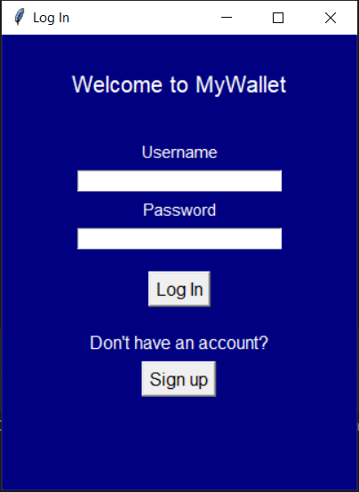
  
Log In

  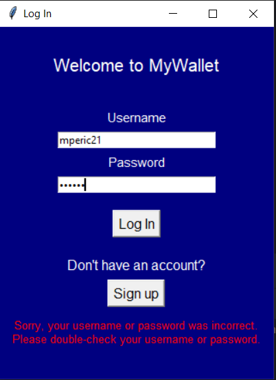
  
Verification of entered data

  

  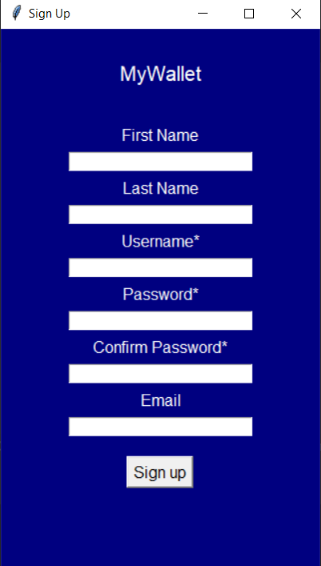
  
Sign Up

  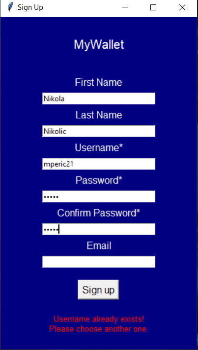
  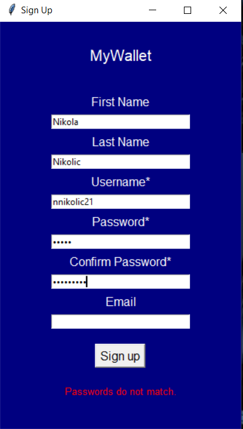
  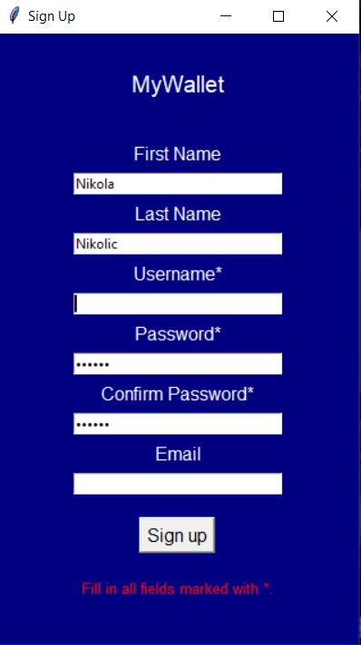
  
Verification of entered data

  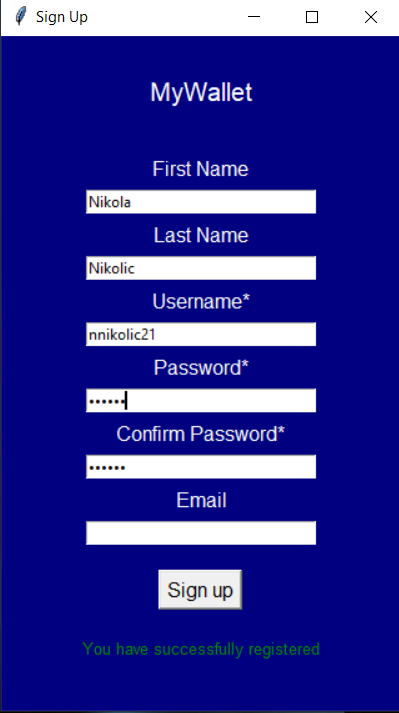
  
Successful registration

  

  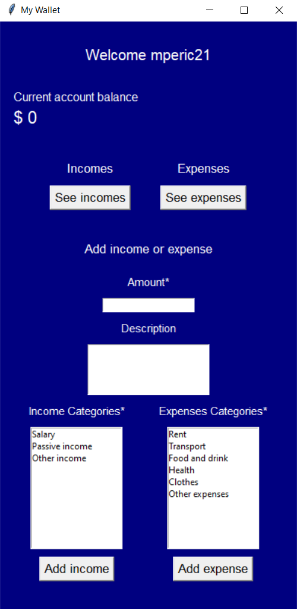
  
Application

  
  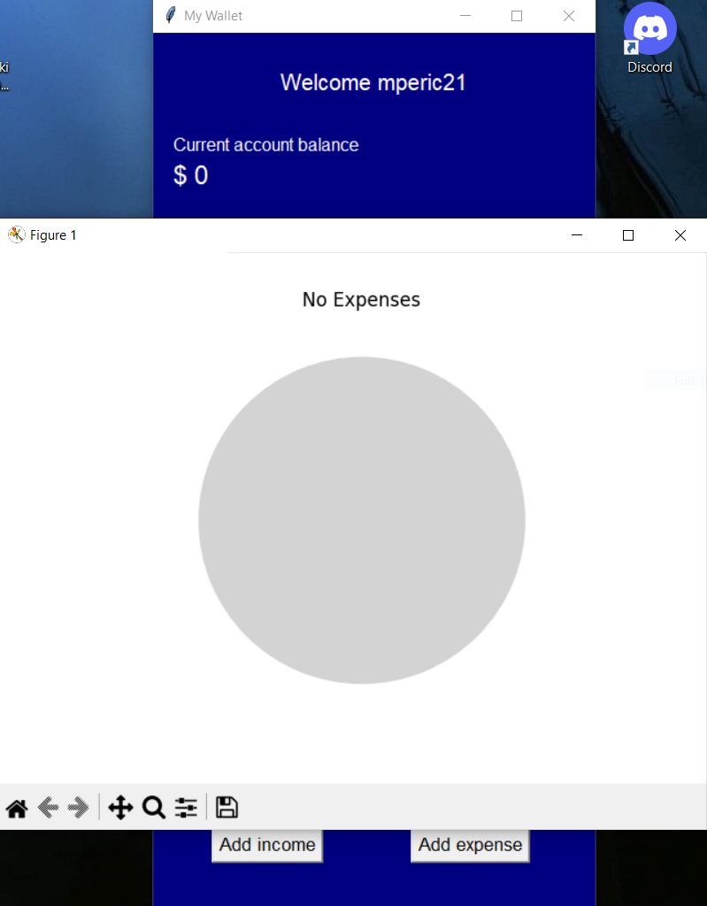
  
Incomes and Expenses before addition

  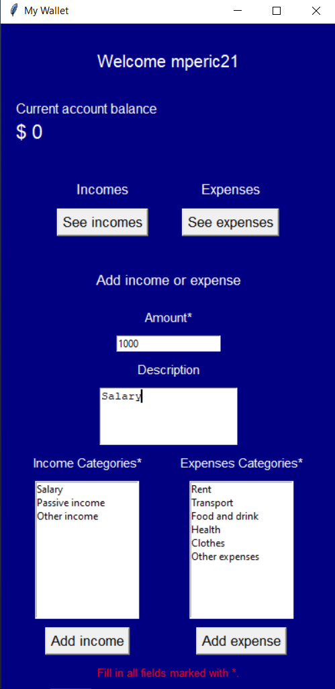
  
Verification of entered data

  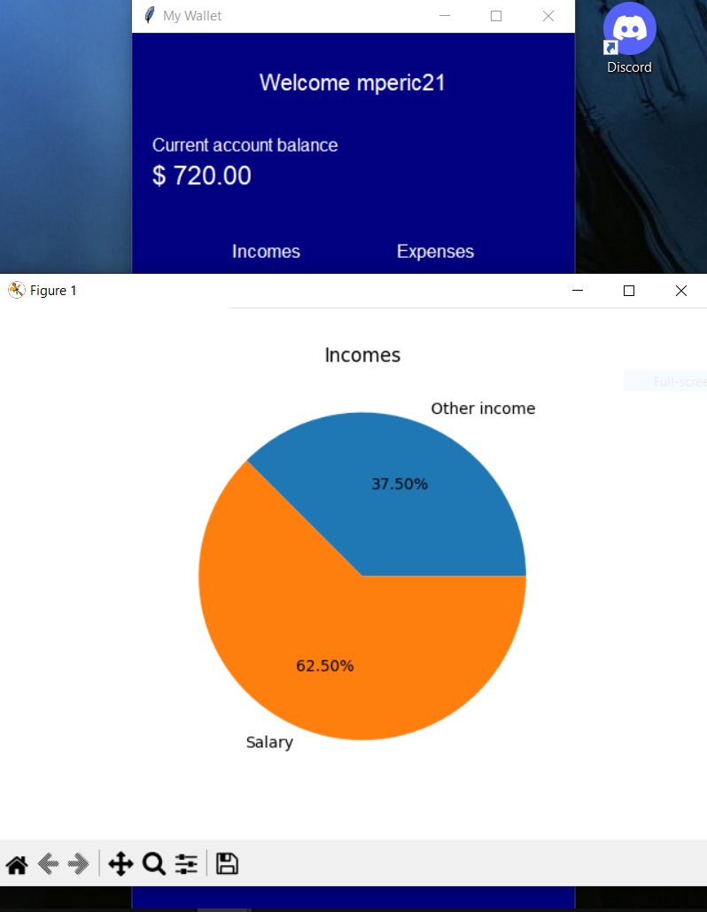
  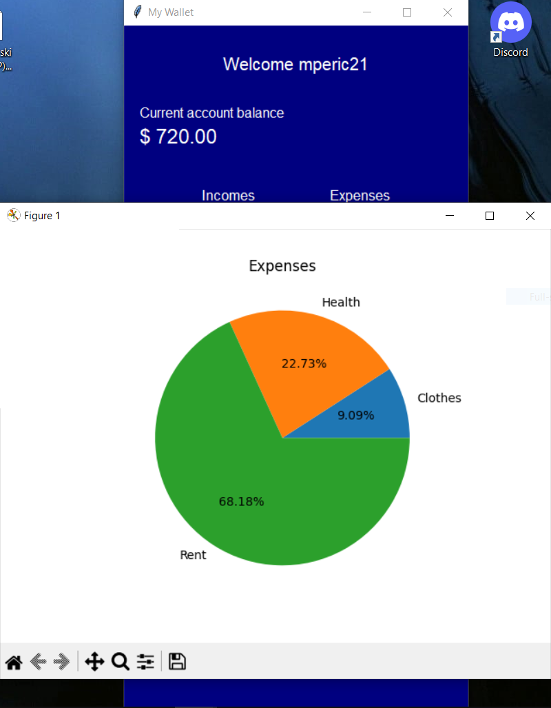
  
Incomes and Expenses after addition

