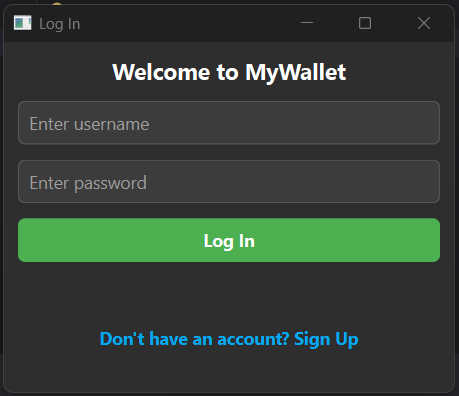
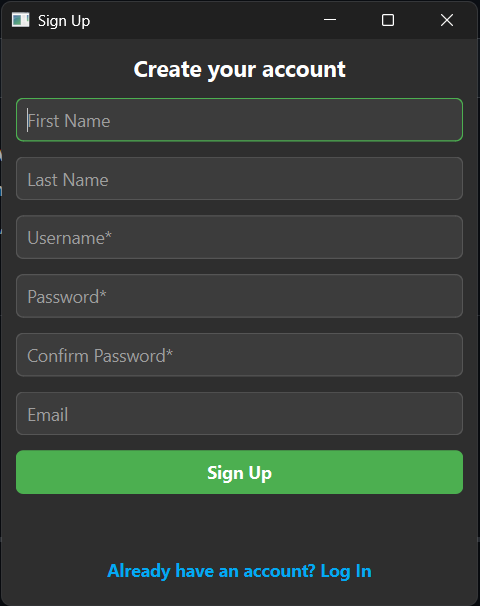
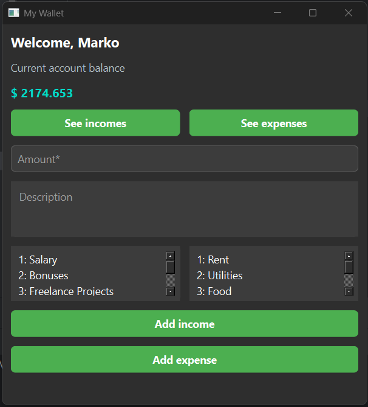
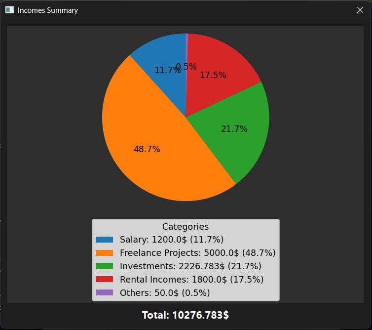
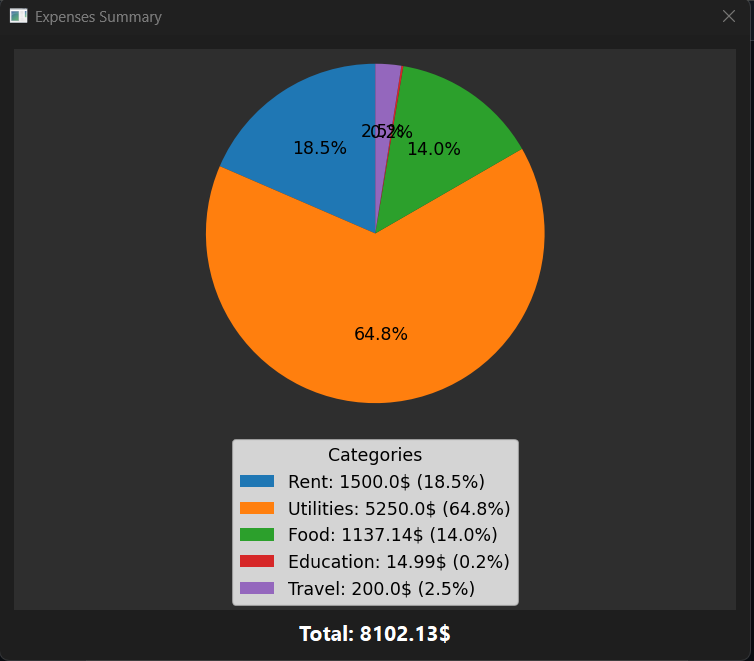

# MyWallet

## Table of Contents

1. [Introduction](#introduction)  
2. [Process and Information Flow Analysis](#process-and-information-flow-analysis)  
3. [Conceptual and Physical Model](#conceptual-and-physical-model)  
4. [Implementation Conditions](#implementation-conditions)  
5. [Visual Overview](#visual-overview)
6. [MyWallet in Action](#mywallet-in-action)

---

## Introduction

This project aims to develop the **MyWallet** application, which enables users to efficiently manage their incomes and expenses.  
The application is built using **Python**, **SQLAlchemy** for database interaction with **SQL Server**, and **PySide6** for the graphical user interface.  

The system provides a simple yet powerful platform where users can:
- Register and log in securely.
- Add and view income and expense records.
- Instantly visualize their financial data with interactive charts.
- Monitor balance changes in real time.

The main purpose of MyWallet is to simplify personal finance tracking and encourage users to manage their budgets effectively.

---

## Process and Information Flow Analysis

The workflow of the system can be divided into the following stages:

1. **User Registration**  
   Users enter their personal details such as username, email, and password. The system validates these inputs and stores them in the database. Duplicate accounts are prevented.

2. **Login Authentication**  
   Existing users can log in using their username and password. The system checks credentials against the stored database records and grants access to the application dashboard upon successful authentication.

3. **My Wallet Home**  
   After logging in, the user is presented with a home page showing:
   - Current balance (Income – Expenses)
   - Pie charts showing the distribution of income sources and expenses by category
   - Buttons for adding new Income or Expense entries

4. **Adding Transactions**  
   Users can add income or expense entries by entering:
   - Amount  
   - Category  
   - Optional description   

   Input validation ensures the entered amount is numeric and positive. Once added, the database is updated, and the dashboard charts refresh automatically.

5. **Data Visualization**  
   The application generates charts to visually represent financial data. Income and expense categories are color-coded, and total amounts are displayed below each chart.

---

## Conceptual and Physical Model

### **Conceptual Model**

The conceptual model defines the main entities and their relationships:

1. **Users** 
   Stores basic information about registered users (first name, last name, username, email, password).

2. **IncomeCategories** 
   Defines categories for income transactions (e.g., Salary, Bonus).

3. **ExpenseCategories** 
   Defines categories for expense transactions (e.g., Food, Rent, Utilities).

4. **Incomes** 
   Records income transactions linked to users and income categories.

5. **Expenses** 
   Records expense transactions linked to users and expense categories.

---

### **Physical Model**

| Table Name            | Description               | Columns                                                                                                                         |
| --------------------- | ------------------------- | ------------------------------------------------------------------------------------------------------------------------------- |
| **Users**             | Stores user information   | `UserID` *(PK)*, `FirstName`, `LastName`, `Username`, `Password`, `Email`                                                       |
| **IncomeCategories**  | Stores income categories  | `CategoryID` *(PK)*, `CategoryName`                                                                                             |
| **ExpenseCategories** | Stores expense categories | `CategoryID` *(PK)*, `CategoryName`                                                                                             |
| **Incomes**           | Stores income records     | `IncomeID` *(PK)*, `UserID` *(FK → Users.UserID)*, `CategoryID` *(FK → IncomeCategories.CategoryID)*, `Amount`, `Description`   |
| **Expenses**          | Stores expense records    | `ExpenseID` *(PK)*, `UserID` *(FK → Users.UserID)*, `CategoryID` *(FK → ExpenseCategories.CategoryID)*, `Amount`, `Description` |

---

## Implementation Conditions

To successfully run and test the **MyWallet** application, the following conditions must be met:

### **Software Requirements**
- **Python 3.12**  
- **Libraries:**
  - `SQLAlchemy` — ORM for database management  
  - `PySide6` — for the GUI  

### **Database Requirements**
- **SQL Server** with a database named **your_database_name**  
- Tables are initialized automatically using the SQLAlchemy ORM.  
- A valid ODBC driver must be installed (e.g., *ODBC Driver 18 for SQL Server*).

## Visual Overview

Below are example screenshots demonstrating the workflow of the MyWallet application.

### **Login Page**

User login form

---

### **Registration Page**

Registration form

---

### **Home**

My Wallet Home

Showing income overview with pie chart and legend.

Showing expense overview with pie chart and legend.

---

## MyWallet in Action

  

